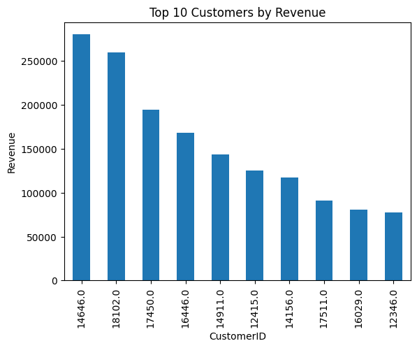
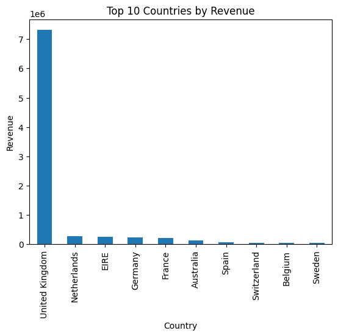
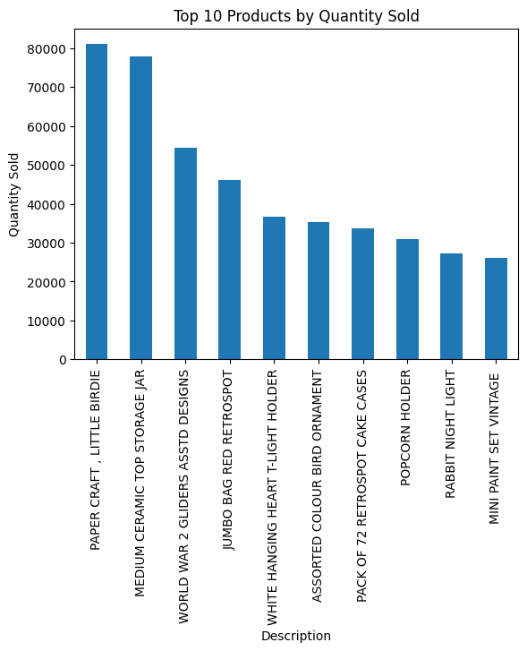

# Online Retail Sales Analysis | Cloud (AWS S3) | Python | SQL

## 📊 Overview
This project analyzes real-world online retail sales data to uncover business insights.  
It demonstrates full data handling from cloud storage to visualization using Python, SQL, and AWS.

- Hosted dataset on AWS S3 (Amazon Cloud Storage)
- Cleaned and processed data using Python (Pandas)
- Structured cleaned data into SQLite database for efficient querying
- Performed complex SQL analysis to extract business KPIs
- Built visualizations for executive reporting using Matplotlib

---

## ☁️ Cloud Hosting (AWS S3)
- The raw dataset was uploaded to an AWS S3 bucket.
- Data was accessed in Python via a pre-signed S3 URL to simulate real-world cloud architecture.
- This approach replicates how companies access data stored in cloud platforms.

---

## 🛠 Tools and Technologies Used
- **Cloud:** AWS S3
- **Programming:** Python (Pandas, Matplotlib, SQLite3)
- **Database:** SQLite
- **Query Language:** SQL
- **Environment:** Google Colab
- **Version Control:** GitHub, GitHub Desktop

---

## 🧹 Data Cleaning and Storage
- Removed missing Customer IDs
- Filtered out negative quantities
- Stored cleaned data into `retail_data.db` (SQLite Database)
- Exported a cleaned CSV (`OnlineRetail_Cleaned.csv`) for reference

---

## 📈 Key Business Insights

### 🔹 Top 10 Customers by Revenue

### 🔹 Top 10 Countries by Revenue

### 🔹 Top 10 Products by Quantity Sold

---

## 🛢 Dataset Details
- Original source: UCI Machine Learning Repository
- Raw dataset uploaded to AWS S3
- Cleaned dataset stored in:
  - `retail_data.db` (SQLite database)
  - `OnlineRetail_Cleaned.csv` (CSV format)

---

## 📚 What I Learned
- Cloud data integration with AWS S3
- End-to-end data cleaning pipelines
- SQL query optimization for large datasets
- Visual storytelling for business decision-making
- Real-world workflow of Data Analytics projects

---

## 🚀 Future Work
- Build a full BI dashboard (Power BI / Tableau)
- Automate data ingestion using AWS Lambda or AWS Glue
- Extend to predictive analytics (sales forecasting)

---

# 📬 Connect with Me
- **LinkedIn:** [Krishna Teja Kotla](https://www.linkedin.com/in/krishnatejakotla/)
- **GitHub:** [krishnatejakotla](https://github.com/krishnatejakotla)

---

